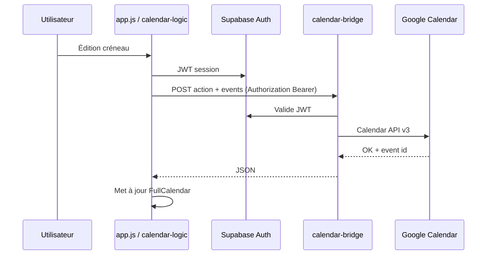

# Architecture technique

## Vue d’ensemble

```
[ Navigateur — PWA statique (GitHub Pages) ]
       │
       ├─► Supabase Auth + REST (profiles, tables métier, RPC)
       │
       ├─► Edge Function `calendar-bridge` (JWT → Google Calendar API v3)
       ├─► Edge Function `planning-admin` (JWT admin → Auth admin API + profiles/pool)
       └─► Edge Function `planning-slot-notify` (JWT → e-mail Brevo si créneau tiers modifié)
```

- **Front** : HTML fragmenté (`components/`), JS **ES modules** sans bundler obligatoire en dev, **FullCalendar**, **Tailwind + DaisyUI** compilés en `css/tailwind.generated.css`.
- **Cache** : **Service Worker** `sw.js` + version `js/config/cache-name.js` (incrémenter quand les assets précachés changent).

## Point d’entrée et bootstrap

| Fichier | Rôle |
|---------|------|
| `index.html` | Shell : `#calendar`, légende, conteneurs header/modales |
| `js/core/app.js` | Init : `loadUIComponents`, FullCalendar, auth, toolbar, liaison `calendar-logic` |
| `js/utils/loader.js` | `fetch` parallèle des fragments HTML → injection dans `#app-header` / `#app-modals` |

## Cœur métier calendrier

| Module | Rôle |
|--------|------|
| `js/core/calendar-logic.js` | Événements FC, modale réservation, droits, sync Google, récurrence, notifications |
| `js/core/calendar-bridge.js` | Client HTTP vers `calendar-bridge` (liste / insert / patch / delete) |
| `js/config/fc-settings.js` | Construction des options FullCalendar (vues, `slotMinTime` / `slotMaxTime` via org settings) |
| `js/core/calendar-toolbar.js` | Boutons vue, navigation, menu |
| `js/core/reservation-motifs.js` | Motifs, normalisation, libellés affichés (`motifDisplayLabel`) |

## Authentification et session

| Module | Rôle |
|--------|------|
| `js/core/auth-logic.js` | Login / logout, démo locale si pas de Supabase, politique mots de passe |
| `js/core/supabase-client.js` | Client Supabase, `planning.config.js` |
| `js/core/supabase-auth.js` | Session → utilisateur app (`name`, `email`, `role`, `id`) + `nom`/`prenom`/`display_name` |
| `js/core/session-user.js` | Utilisateur courant pour le reste de l’UI |
| `js/utils/profile-full-name.js` | `formatProfileFullName(nom, prenom)` |
| `js/utils/user-profile.js` | Préférences `reservation_types` (titres) + sync `profiles` |

## Fonctionnalités par domaine (fichiers repères)

| Domaine | Fichiers principaux |
|---------|---------------------|
| Admin comptes | `admin-users-ui.js`, `admin-api.js`, `planning-admin` Edge, `modal-users-admin.html` |
| Pool calendriers | `admin-calendar-pool-ui.js`, `modal-calendar-pool.html`, SQL pool + triggers |
| Config orgue | `config-ui.js`, `organ-settings.js`, `modal-config.html`, table `organ_school_settings` |
| Semaines A/B | `week-cycle.js`, `semaines-types-ui.js`, `template-apply-engine.js`, `modal-semaines-types.html` |
| Profil utilisateur | `profile-ui.js`, `modal-profile.html`, `planning-courses.js` |
| Contenu éditorial | `org-content.js`, `planning-quill.js`, modales règles / annonces / messages |
| Notifications créneau | `slot-notify-api.js`, `planning-slot-notify` |

## Supabase

### Schéma et migrations

- Fichier de référence historique : `supabase/schema.sql` (nouveau projet vierge).
- Évolutions versionnées : `supabase/migrations/` (`002` … `011` : contenu admin, rôles, `reservation_types`, RPC liste utilisateurs, consignes, pool Google, cycle semaine, gabarit école, `nom`/`prenom`, etc.).
- **RLS** : lecture / update profil par utilisateur ; fonctions `security definer` pour listes admin / élèves actifs.

### Edge Functions (Deno)

| Fonction | Rôle |
|----------|------|
| `calendar-bridge` | Vérifie JWT GoTrue ; appels Calendar API (SA ou OAuth refresh) ; actions list/create/update/delete ; champs étendus (`inscrits`, `calendarId`, …). |
| `planning-admin` | Vérifie `profiles.role = admin` ; liste utilisateurs (RPC ou fallback Auth list) ; invite, create, rôle, suspend, pool CRUD de base, etc. |
| `planning-slot-notify` | E-mail via Brevo si un tiers modifie le créneau d’un autre. |
| `_shared/auth_gotrue.ts` | Récupération utilisateur depuis le JWT. |

## Configuration front

- `js/config/planning.config.js` : `supabaseUrl`, `supabaseAnonKey`, `calendarBridgeUrl`, IDs / labels Google « principal » pour liens profil.
- Ne pas commiter de secrets en clair sur un dépôt public ; en CI/CD, injecter ou surcharger ce fichier.

## Déploiement

- **GitHub Pages** : workflow qui produit `_site/` (voir README racine).
- **Supabase** : migrations SQL + `supabase functions deploy <name>`.

## Diagramme simplifié des flux « créneau »


