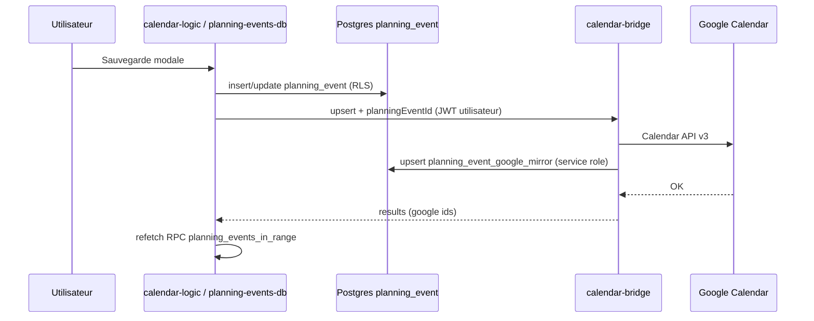

# Architecture technique

## Vue d’ensemble

```
[ Navigateur — PWA statique (GitHub Pages) ]
       │
       ├─► Supabase Auth + REST (profiles, tables métier, RPC)
       │       · Mode grille DB : créneaux = table planning_event + RPC planning_events_in_range
       │
       ├─► Edge Function `calendar-bridge` (JWT → Google Calendar API v3 ; persistance miroir SQL si planningEventId)
       ├─► Edge Function `planning-admin` (JWT admin → Auth admin API + profiles/pool)
       └─► Edge Function `planning-slot-notify` (JWT → e-mail Brevo si créneau tiers modifié)
```

**Suite migration 015–016** : la **vérité métier** des créneaux peut résider dans **`planning_event`** ; Google est un **miroir** (`planning_event_google_mirror`). Détail et backlog : **[docs/HANDOFF.md](./HANDOFF.md)**.

- **Front** : HTML fragmenté (`components/`), JS **ES modules** sans bundler obligatoire en dev, **FullCalendar**, **Tailwind + DaisyUI** compilés en `css/tailwind.generated.css`.
- **Cache** : **Service Worker** `sw.js` + version `js/config/cache-name.js` (incrémenter quand les assets précachés changent).

## Point d’entrée et bootstrap

| Fichier | Rôle |
|---------|------|
| `index.html` | Shell : `#calendar`, légende, conteneurs header/modales |
| `js/core/app.js` | Init : `loadUIComponents`, FullCalendar, auth, toolbar, liaison `calendar-logic` |
| `js/utils/loader.js` | `fetch` parallèle des fragments HTML → injection dans `#app-header` / `#app-modals` |

## Barre du haut (`components/headers.html`)

- **Nom affiché** : prénom puis nom (`formatProfileFullName` + `supabase-auth.js`).
- **Icône calendrier** (`#btn-header-semaines-types`) : prof. / admin. — modale semaines types A/B (`semaines-types-ui.js`).
- **Icône engrenage** : même public — menu **Réglages** : configuration planning, gestion comptes (admin), calendriers des utilisateurs (admin), annonces (prof./admin.).
- **Icône personne** : tous les rôles — Profil, mot de passe, aide, déconnexion.
- Visibilité des deux premiers blocs : `refreshHeaderUser` dans `app.js` (staff + backend configuré).

## Cœur métier calendrier

| Module | Rôle |
|--------|------|
| `js/core/calendar-logic.js` | Événements FC, modale réservation, droits, sync Google, persistance `planning_event` si grille DB, récurrence, notifications |
| `js/core/planning-events-db.js` | RPC grille, upsert/delete événement canonique, miroirs pour delete, `planning_user_id_for_email` |
| `js/core/calendar-bridge.js` | Client HTTP vers `calendar-bridge` (liste / upsert / delete) |
| `js/config/fc-settings.js` | Construction des options FullCalendar (vues, `slotMinTime` / `slotMaxTime` via org settings) |
| `js/core/calendar-toolbar.js` | Boutons vue, navigation, menu |
| `js/core/reservation-motifs.js` | Motifs, normalisation, libellés affichés (`motifDisplayLabel`) |

### Conventions de rendu (état actuel)

- Motifs distincts : `Fermeture`, `Cours`, `Travail`, `Concert`, `Autre`.
- `Concert` / `Autre` / `Travail` n’ouvrent pas de gestion d’inscrits.
- Modale `Cours` : inscrits en lecture seule par défaut ; édition via icône utilisateurs (double-clic/clic + drag&drop), max 5 élèves.
- Légende planning : libellé explicite **« Autres réservations »** pour éviter la confusion avec le motif **« Autre »**.

## Authentification et session

| Module | Rôle |
|--------|------|
| `js/core/auth-logic.js` | Login / logout Supabase, politique mots de passe |
| `js/core/supabase-client.js` | Client Supabase, `planning.config.js` |
| `js/core/supabase-auth.js` | Session → utilisateur app (`name`, `email`, `role`, `id`) + `nom`/`prenom`/`display_name` |
| `js/core/session-user.js` | Utilisateur courant pour le reste de l’UI |
| `js/utils/profile-full-name.js` | `formatProfileFullName(nom, prenom)` → affichage **Prénom Nom** (bandeau, session) |
| `js/utils/user-profile.js` | Préférences `reservation_types` (titres) + sync `profiles` |

## Fonctionnalités par domaine (fichiers repères)

| Domaine | Fichiers principaux |
|---------|---------------------|
| Admin comptes | `admin-users-ui.js`, `admin-api.js`, `planning-admin` Edge, `modal-users-admin.html` |
| Pool calendriers | `admin-calendar-pool-ui.js`, `modal-calendar-pool.html`, SQL pool + triggers |
| Config orgue | `config-ui.js`, `organ-settings.js`, `modal-config.html`, table `organ_school_settings` (`planning_error_notify_email`) |
| Semaines A/B | `week-cycle.js`, `semaines-types-ui.js`, `template-apply-engine.js`, `modal-semaines-types.html` |
| Profil utilisateur | `profile-ui.js`, `modal-profile.html`, `planning-courses.js` |
| Contenu éditorial | `org-content.js`, `planning-quill.js`, modales règles / annonces / messages |
| Notifications créneau | `slot-notify-api.js`, `planning-slot-notify` |

## Supabase

### Schéma et migrations

- Fichier de référence historique : `supabase/schema.sql` (nouveau projet vierge).
- Évolutions versionnées : `supabase/migrations/` (jusqu’à **`022`** : base canonique `015–016`, inscrits RPC `017`, RLS enrollment prof `018`, visibilités select `021`, labels profils cross-rôles `022`).
- **RLS** : lecture / update profil par utilisateur ; fonctions `security definer` pour listes admin / élèves actifs ; politiques **`planning_event`** / **`planning_event_google_mirror`** (voir migrations).

### Edge Functions (Deno)

| Fonction | Rôle |
|----------|------|
| `calendar-bridge` | JWT GoTrue ; Calendar API (SA ou OAuth) ; `list` / `upsert` / `delete` ; miroir agenda pool ; si `planningEventId` + clé service role (`SUPABASE_SERVICE_ROLE_KEY` ou secret Edge `SERVICE_ROLE_KEY`) → upsert `planning_event_google_mirror`. |
| `planning-admin` | Vérifie `profiles.role = admin` ; liste utilisateurs (RPC ou fallback Auth list) ; invite, create, rôle, suspend, pool CRUD de base, etc. |
| `planning-slot-notify` | E-mail via Brevo si un tiers modifie le créneau d’un autre. |
| `_shared/auth_gotrue.ts` | Récupération utilisateur depuis le JWT. |

## Configuration front

- `js/config/planning.config.js` : `supabaseUrl`, `supabaseAnonKey`, `calendarBridgeUrl`, IDs / labels Google « principal » pour liens profil.
- Ne pas commiter de secrets en clair sur un dépôt public ; en CI/CD, injecter ou surcharger ce fichier.

## Déploiement

- **GitHub Pages** : workflow qui produit `_site/` (voir README racine).
- **Supabase** : migrations SQL + `supabase functions deploy <name>`.

## Diagramme simplifié des flux « créneau »

### Grille lue depuis Postgres



